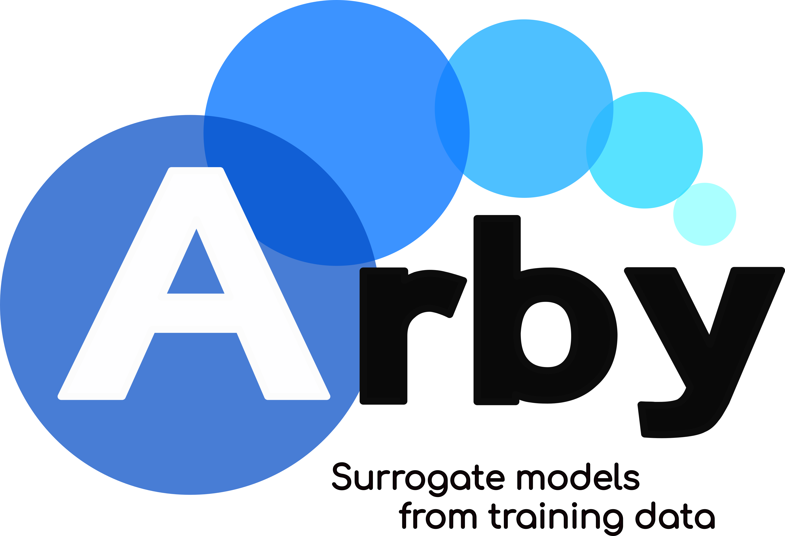

# Arby



[](https://badge.fury.io/py/arby)
[](https://travis-ci.com/aaronuv/arby)
[](https://arby.readthedocs.io/en/latest/?badge=latest)
[](https://codecov.io/gh/aaronuv/arby)
[](https://img.shields.io/badge/python-3.6%20%7C%203.7%20%7C%203.8-blue)
[](https://github.com/leliel12/diseno_sci_sfw)

Arby is a fully data-driven Python module to construct surrogate models, reduced bases and empirical interpolants from training data.

This module implements a type of [Reduced Order Modeling](https://en.wikipedia.org/wiki/Model_order_reduction) technique for reducing the computational complexity of mathematical models in numerical simulations.

# Install

    pip install arby

or, after cloning this repo, execute inside the directory

    pip install -e .

# Quick Usage

Suppose we have a set of real functions parametrized by a real number &lambda;. This set,
the *training set*, represents an underlying parametrized model f<sub>&lambda;</sub>(x)
with continuous dependency in &lambda;. Without a complete knowledge about f<sub>&lambda;</sub>(x),
we'd like to produce an accurate approximation only through access to the training set.

With Arby we can do this by building a *surrogate model* for the original one using only the training set. For simplicity,
suppose a discretization of the parameter domain [`par_min`, `par_max`] with `Ntrain` samples
indexing the training set
```
params = np.linspace(par_min, par_max, Ntrain)
```
and a discretization of the x domain [a,b] in `Nsamples` points
```
x_samples = np.linspace(a, b, Nsamples)
```
Next, we build a training set
```
training_set = [f(par, x_samples) for par in params]
```
that has shape (`Ntrain`,`Nsamples`).

Finally, we build the surrogate model by executing:

    from arby import ReducedOrderModel as ROM
    f_model = ROM(training_space=training_set,
                  physical_interval=x_samples,
                  parameter_interval=params)
    
With `f_model` we can get function samples for any parameter `par` in the
interval [`par_min`, `par_max`] simply by calling it:

    f_model_at_par = f_model.surrogate(par)
    plt.plot(x_samples, f_model_at_par)
    plt.show()

# Documentation

For more details and examples check the [read the docs](https://arby.readthedocs.io/en/latest/).

# License

MIT

# Contact Us

<aaron.villanueva@unc.edu.ar>

***

(c) 2020 Aarón Villanueva
