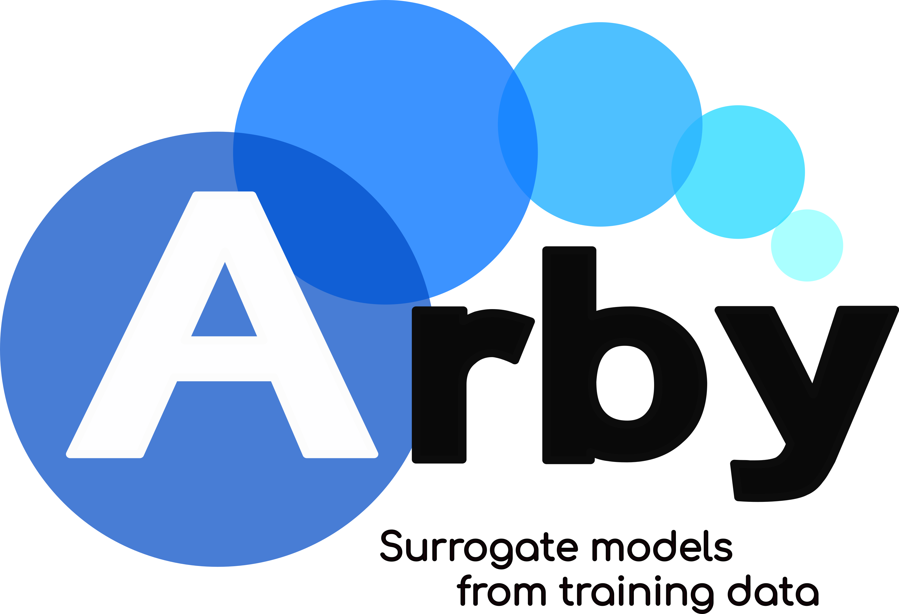

.. Arby documentation master file, created by
   sphinx-quickstart on Wed Nov 18 01:40:25 2020.
   You can adapt this file completely to your liking, but it should at least
   contain the root `toctree` directive.

Arby's documentation
====================

.. image:: https://badge.fury.io/py/arby.svg
   :target: https://badge.fury.io/py/arby
   :alt: PyPI version

.. image:: https://travis-ci.com/aaronuv/arby.svg?branch=master
   :target: https://travis-ci.com/aaronuv/arby
   :alt: Build Status

.. image:: https://img.shields.io/badge/python-3.6%20%7C%203.7%20%7C%203.8-blue
   :target: https://img.shields.io/badge/python-3.6%20%7C%203.7%20%7C%203.8-blue
   :alt: Python version
   
.. image:: https://img.shields.io/badge/DiSoftCompCi-FAMAF-ffda00
   :target: https://github.com/leliel12/diseno_sci_sfw
   :alt: Curso doctoral FAMAF: Diseño de software para cómputo científico

`Arby <https://github.com/aaronuv/arby>`_ is a fully data-driven Python module
to construct surrogate models, reduced bases and empirical interpolants from training data.

This module implements a type of `Reduced Order Modeling <https://en.wikipedia.org/wiki/Model_order_reduction>`_
technique for reducing the computational complexity of mathematical models in numerical simulations.

.. toctree::
   :maxdepth: 3
   :caption: Contents

   installation
   pendulum
   api

Quick Usage
===========

Suppose we have a set of real functions parametrized by a real number :math:`\lambda`. This set,
the *training set*, represents an underlying parametrized model :math:`f_\lambda(x)`
with continuous dependency in :math:`\lambda`. Without complete knowledge about :math:`f_\lambda`,
we'd like to produce an accurate approximation only through the access to the training set.

With Arby we can build an accurate *surrogate model* to represent the training set. For simplicity,
suppose a discretization of the parameter domain [``par_min``, ``par_max``] with ``Ntrain`` samples
indexing the training set
::

        params = np.linspace(par_min, par_max, Ntrain)

and a discretization of the :math:`x` domain :math:`[a,b]` in ``Nsamples`` points
::

        x_samples = np.linspace(a, b, Nsamples)

Next, we build a training set
::

        training_set = [f(par, x_samples) for par in params]

that has shape (``Ntrain``, ``Nsamples``).

Then we build the surrogate model with Arby by doing:
::

        from arby import ReducedOrderModel as ROM
        f_model = ROM(training_space=training_set,
                      physical_interval=x_samples,
                      parameter_interval=params)

With ``f_model`` we can get function samples for any parameter ``par`` in the
interval [``par_min``, ``par_max``] simply by calling it:
::

        f_model_at_par = f_model.surrogate(par)
        plt.plot(x_samples, model_at_par)
        plt.show()
