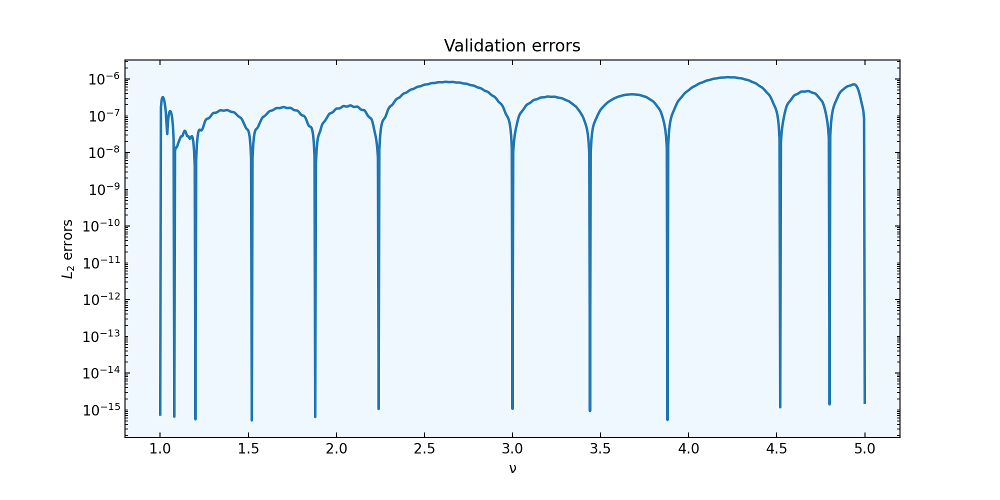
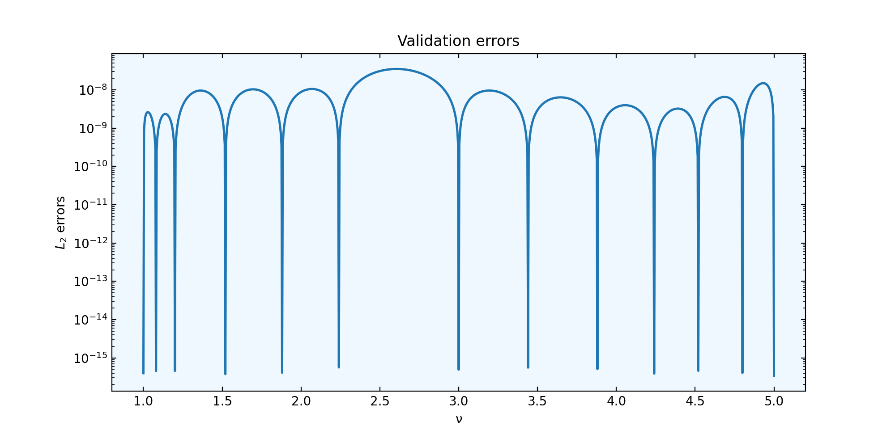

Tutorial
========

Example: Bessel functions of first kind
---------------------------------------

Build a surrogate model
^^^^^^^^^^^^^^^^^^^^^^^

Suppose we want to find surrogates functions for solutions of the Bessel
differential equation with a free parameter :math:`\nu`.

.. math::

    x^2 \frac{d^2f}{dx^2} + x \frac{df}{dx} + (x^2 - \nu^2)y = 0

Suppose we have numerical solutions :math:`J_{\nu}(x)` for particular values of
the parameter :math:`\nu`, say, for a discretized interval :math:`[1, 5]` with
101 samples, defined in some interval for :math:`x`. For convention, we will
refer to :math:`\nu` as the parameter variable and :math:`x` as the physical one.
So each one belongs to a parameter space and a physical domain, respectively.

We can use Arby to build a surrogate model for this data set. In this example,
we will generate the sample data using scipy's Bessel special functions.

.. code-block:: python

        from arby import ReducedOrderModel as ROM
        from scipy.special import jv as BesselJ

        npoints = 101
        nsamples = 1001
        
        # Sample parameter nu and variable x
        nu = np.linspace(1, 5, num=npoints)
        x = np.linspace(0, 100, num=nsamples)

        # build traning set
        training = np.array([BesselJ(nn, x) for nn in nu])

        # create a model
        bessel_model = ROM(training_space=training,
                           physical_interval=x,
                           parameter_interval=nu)

        # build and evaluate the surrogate at some parameter `par`
        bessel_par = bessel_model.surrogate(par)

Note that ``par`` does not necessarily belong to the set of training parameters.

As a mode of illustration, we plot both models, the original the surrogate :math:`J_\nu(x)`
and the surrogate :math:`J_\nu^{sur}(x)`, at some parameter values in the interval :math:`[1,5]`.
::

        import matplotlib.pyplot as plt

        plt.figure(figsize=(8,5))
        plt.plot(x, bessel.surrogate(2), 'r', lw=2, label='$J_ν(x)$')
        plt.plot(x, BesselJ(2,x), 'b-.', lw=2, label='$J_ν^{sur}(x)$')
        plt.xlabel('$x$')
        plt.title('Function curves at ν = 2')
        plt.legend(fontsize = 'large')
        plt.show()

.. image:: _static/bessel_sur_rep.png
    :width: 700px
    :align: center
    :height: 400px
    :alt: bessel representation

This plot represents an *in-sample* validation. To see the predictive power of our model, we have to test
it in an *out-of-sample* manner, say, by plotting at parameters that are not present in the training
parameter set. For instance, :math:`\nu = 4.30`.

.. image:: _static/bessel_sur_pred.png
    :width: 700px
    :align: center
    :height: 400px
    :alt: bessel prediction

As we can see, the surrogate model predicts quite well the Bessel function.
We can test the accuracy of our model in a precise sense by using the integration tools
of Arby. We take as a metric the :math:`L_2`-norm of the difference between the two
models.

.. math::

    e(\nu)^2 = \| J_\nu - J_\nu^{sur} \|^2 = \int_{[a,b]} |J_\nu(x) - J_\nu^{sur}(x)|^2 dx

We compute this for an arbitrary parameter ``par`` simply by calling the ``integration``
object defined inside the ``bessel_model``. This object comprises quadrature rules
to define an integration scheme.
::

        L2_error = bessel_model.integration.norm(BesselJ(par, x) - bessel_par)

For instance, for ``par = 4.30`` it gives ``L2_error = 1.1533694546001233e-06``. Let us compute
a benchmark for the entire parameter interval with a dense sampling ``nu_val`` for
validation.
::

        # discretization 10X more dense than `nu`
        nu_val = np.linspace(1, 5, num=npoints*10)

        # compute errors for `nu_eval`
        errors = errors = [
                 bessel.integration.norm(BesselJ(par, x) - bessel.surrogate(par))
                 for par in nu_val
                          ]

        # plot
        fig = plt.figure(figsize=(8,3))
        plt.semilogy(nu_val, errors, lw=1.5)
        plt.xlabel('$x$')
        plt.ylabel('$L_2$ errors')
        plt.title('Validation errors')
        plt.show()

As we can see, the maximum error is about :math:`\sim` 1e-6 or, squared, :math:`\sim` 1e-12,
which is the same value as the default value of the ``greedy_tol`` parameter of
the ``ReducedOrderModel`` class:
::

        bessel.greedy_tol
        >>> 1e-12

This isn't a coincidence. The accuracy of the surrogate model is partly controlled
by ``greedy_tol`` (see the next section). Another parameter to improve the accuracy
is ``poly_deg`` (Default=3) which dictates the polynomial order of the interpolation
functions used to build the model.

If we want to improve the accuracy, we just tune the ``greedy_tol`` and/or the ``poly_deg``
parameters at the moment of generate the ``bessel_model`` object. For example,
::

        # create a model
        bessel_model = ROM(training_space=training,
                           physical_interval=x,
                           parameter_interval=nu,
                           greedy_tol=1e-14,
                           poly_deg=5)        

Next, we try the same benchmark as before, but now for the new model, obtaining

This time, the squared maximum error is about :math:`\sim` 1e-16!

Build a reduced basis
^^^^^^^^^^^^^^^^^^^^^

Lets go deeper. The Reduced Basis Method (RBM) [1]_ is a reduced order modeling technique to find a
cuasi-optimal basis of functions capable of span the entire training set with an user specified tolerance.
The approach is through projections, say, we need to define an inner product to perform projections
and construct the approximation.

Suppose we have a training set :math:`\{f_{\lambda_i}\}_{i=1}^N` of parameterized real
functions. This set may represent a non-linear model, perhaps solution of PDEs. We would
like, if possible, to reduce the dimensionality/complexity of these set by traying to find a
compact representation in terms of linear combinations of basis elements
:math:`\{e_i\}_{i=1}^n`, that is,

.. math::

        f \approx \sum_{i=1}^n c_i e_i\,.

f is an arbitrary training function and the :math:`c_i`'s are the projection coefficients
:math:`<e_i,f>` computed in some inner product :math:`<\cdot,\cdot>` on the space of functions.
The RB method choose a set of optimal functions that belongs to the training set to build a
finite dimensional subspace capable to represent the entire training set up to a prefixed tolerance
chosen by the user.

To build a reduced basis with Arby, you just provide the training set of functions and the
discretization of the physical variable :math:`x` to the ``ReducedOrderModel`` class.
The later is to define the integration scheme used to compute inner products. For the
Bessel example,

.. code-block:: python

        bessel_model = ROM(training_space=training,
                           physical_interval=x, greedy_tol=1e-12)

The ``greedy_tol`` parameter is the accuracy in the :math:`L_2`-norm that our
reduced basis is expected to achieve. To build the basis, just call it:

.. code-block:: python

        reduced_basis = bessel_model.basis

This builds an orthonormalized basis. We can access to the *greedy points* through
``bessel_model.greedy_indices``. These indices mark those functions in the training
set that was selected to span the approximating subspace. For stability reasons,
they are iteratively orthonormalized in the building stage. The number of basis
elements ``bessel_model.Nbasis`` represents the dimension of the subspace and is not
fixed. It changes if we change the greedy tolerance. The lower the tolerance,
the bigger the number of basis elements needed to reach that accuracy. With Arby,
we can tune the accuracy of the reduced basis through ``greedy_tol``.

To measure the effectiveness of the reduced basis in approximatting the training
functions we do

.. code-block:: python

        projected_f = bessel_model.project(f, reduced_basis)
        squared_L2_error = bessel_model.integration,norm(f - projected_f)

References
----------

.. [1] Scott E. Field, Chad R. Galley, Jan S. Hesthaven, Jason Kaye,
       and Manuel Tiglio. Fast Prediction and Evaluation of Gravitational
       Waveforms Using Surrogate Models. Phys. Rev. X 4, 031006
