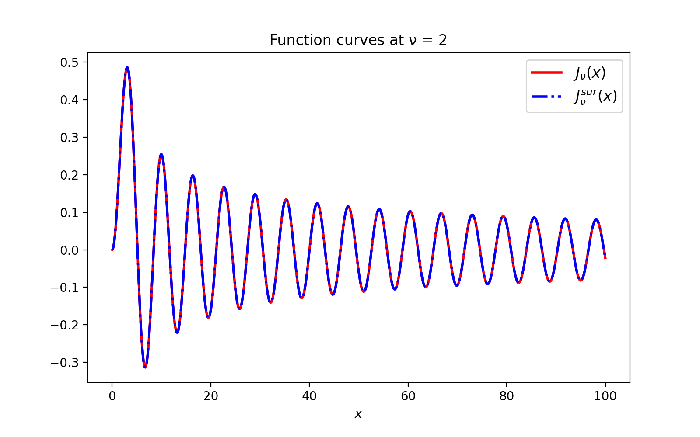

Tutorial
========

Example: Bessel functions of first kind
---------------------------------------

Build a surrogate model
^^^^^^^^^^^^^^^^^^^^^^^

Suppose we want to find surrogates functions for solutions of the Bessel
differential equation with a free parameter :math:`\nu`.

.. math::

    x^2 \frac{d^2f}{dx^2} + x \frac{df}{dx} + (x^2 - \nu^2)f = 0

Suppose we have numerical solutions :math:`J_{\nu}(x)` for particular values of
the parameter :math:`\nu`, say, for a discretized interval :math:`[1, 5]` with
101 samples, defined in some interval for :math:`x`. For convention, we will
refer to :math:`\nu` as the parameter variable and :math:`x` as the physical one.
So each one belongs to a parameter space and a physical domain, respectively.

We can use Arby to build a surrogate model for this data set. In this example,
we will generate the sample data using scipy's Bessel special functions.

.. code-block:: python

        from arby import ReducedOrderModel as ROM
        from scipy.special import jv as BesselJ

        npoints = 101
        nsamples = 1001
        
        # Sample parameter nu and variable x
        nu = np.linspace(1, 5, num=npoints)
        x = np.linspace(0, 100, num=nsamples)

        # build traning set
        training = np.array([BesselJ(nn, x) for nn in nu])

        # create a model
        bessel_model = ROM(training_set=training,
                           physical_points=x,
                           parameter_points=nu)

        # build and evaluate the surrogate at some parameter `par`
        bessel_par = bessel_model.surrogate(par)

Note that ``par`` does not necessarily belong to the set of training parameters.

As a mode of illustration, we plot both models, the original the surrogate :math:`J_\nu(x)`
and the surrogate :math:`J_\nu^{sur}(x)`, at some parameter values in the interval :math:`[1,5]`.

.. code-block:: python

        import matplotlib.pyplot as plt

        plt.figure(figsize=(8,5))
        plt.plot(x, bessel_model.surrogate(2), 'r', lw=2, label='$J_ν(x)$')
        plt.plot(x, BesselJ(2,x), 'b-.', lw=2, label='$J_ν^{sur}(x)$')
        plt.xlabel('$x$')
        plt.title('Function curves at ν = 2')
        plt.legend(fontsize = 'large')
        plt.show()

This plot represents an *in-sample* validation. To see the predictive power of our model, we have to test
it in an *out-of-sample* manner, say, by plotting at parameters that are not present in the training
parameter set. For instance, :math:`\nu = 4.30`.

.. image:: _static/bessel_sur_pred.png
    :width: 700px
    :align: center
    :height: 400px
    :alt: bessel prediction

As we can see, the surrogate model predicts quite well the Bessel function.
We can test the accuracy of our model in a precise sense by using the integration tools
of Arby. We take as metric the relative error given by :math:`L_2`-norm of the difference between the two
models.

.. math::

    e(\nu)^2 := \frac{\| J_\nu - J_\nu^{sur} \|^2}{\| J_\nu \|^2}

donde

.. math::

    \|J_\nu\|^2 := \int_{[a,b]} |J_\nu(x)|^2 dx 

We compute this for an arbitrary parameter ``par`` simply by calling the ``integration``
suite defined inside the ``bessel_model.basis_`` object. It comprises quadrature rules
to define integrals and inner products.
::

        norm = bessel_model.basis_.integration.norm
        L2_error = norm(BesselJ(par, x) - bessel_par)/norm(BesselJ(par, x))

For ``par = 4.30`` it gives ``L2_error = 1.0434605267845736e-06``. Let us compute
a validation benchmark for a dense parameter interval ``nu_val``.

.. code-block:: python

        # discretization 10X more dense than `nu`
        nu_val = np.linspace(1, 5, num=npoints*10)

        # compute errors for `nu_eval`
        errors = np.array(
            [norm(BesselJ(par, x) - bessel.surrogate(par))/norm(BesselJ(par, x))
            for par in nu_val]
            )

Plot ``errors`` vs ``nu_val``.

.. image:: _static/errors.png
    :width: 600px
    :align: center
    :height: 300px
    :alt: bessel errors

As we can see, the maximum error is about :math:`\sim` 1e-6 or, squared, :math:`\sim` 1e-12,
which is the same value as the default value of the ``greedy_tol`` parameter of
the ``ReducedOrderModel`` class:

.. code-block:: python

        bessel.greedy_tol
        >>> 1e-12

This is not a coincidence. The surrogate model accuracy is partly controlled
by ``greedy_tol`` (see the next section). Another parameter to improve the accuracy
is ``poly_deg`` (Default=3) which dictates the polynomial order of the interpolation
functions that are used for building the model.

If we want to improve the accuracy, we just tune the ``greedy_tol`` and/or the ``poly_deg``
parameters at the moment of generate the ``bessel_model`` object. For example,

.. code-block:: python

        # create the model
        bessel_model = ROM(training_set=training,
                           physical_points=x,
                           parameter_points=nu,
                           greedy_tol=1e-14,
                           poly_deg=5)        

Next, we try the same benchmark as before, but now for the new model, obtaining

.. image:: _static/errors_improved.png
    :width: 600px
    :align: center
    :height: 300px
    :alt: bessel errors improvement

This time, the squared maximum error is about :math:`\sim` 1e-16!

Build a reduced basis
^^^^^^^^^^^^^^^^^^^^^

Lets go deeper. The Reduced Basis Method [#TiglioAndVillanueva2021]_ is a reduced order modeling technique for building a
near-optimal basis of functions that spans the training set at an user-specified tolerance. 
The basis is built by iteratively choosing those training functions which best represent the entire set.
In this way, as opposed to other dimensional reduction techniques such as Proper Orthogonal Decomposition,
the reduced basis is directly interpretable since it is built out from training functions. Another kindness
of this approach is that whenever we want more accuracy we just add more basis elements to the computed one:
the construction is hierarchical.

Suppose we have a training set :math:`\{f_{\lambda_i}\}_{i=1}^N` of parameterized real
functions. This set may represent a non-linear model, perhaps solutions to PDEs. We would
like, if possible, to reduce the dimensionality/complexity of it by finding a
compact representation in terms of linear combinations of basis elements
:math:`\{e_i\}_{i=1}^n`, that is,

.. math::

        f \approx \sum_{i=1}^n c_i e_i\,.

f is an arbitrary training function and the :math:`c_i`'s are the projection coefficients
:math:`<e_i,f>` computed in some inner product :math:`<\cdot,\cdot>` on the space of functions.
The RB method chooses a set of optimal functions belonging to the training set itself which defines a
finite dimensional subspace capable to represent the entire training set up to a user-specified tolerance.

To build a reduced basis with Arby, you just provide the training set of functions and the
discretization of the physical variable :math:`x` to the ``reduced_basis`` function.
The later is to define the integration scheme that is used for computing inner products. For the
Bessel example,

.. code-block:: python

        from arby import reduced_basis

        rb_data = reduced_basis(training_set=training,
                           physical_points=x, greedy_tol=1e-12)

The ``greedy_tol`` parameter is the accuracy in the :math:`L_2`-norm that our
reduced basis is expected to achieve. The output ``rb_data`` contains all the relevant information
related to greedy calculations. It contains a ``basis`` object which comprises the reduced basis and several
utilities for interacting with it. The other outputs are the greedy ``errors`` and ``indices``,
and the ``projection_matrix``, which stores projection coefficients built in the greedy algorithm.
For example, to call the reduced basis array do

.. code-block:: python

        rb_data.basis.data

The reduced basis is an orthonormalized version of the set of functions selected by the
greedy algorithm from training data, which are indexed by the greedy indices. You can obtain
those functions by filtering the training set

.. code-block:: python

        training_set[rb_data.indices]

For conditioning purposes, the greedy algorithm orthonormalizes these functions using the inner product
implied by the integration scheme.

The number of basis elements ``rb_data.basis.Nbasis_`` represents the dimension of the reduced space.
It is not a fixed quantity since we change it by modifying the greedy tolerance. The lower the tolerance,
the bigger the number of basis elements needed to reach that accuracy. With Arby,
we can tune the accuracy of the reduced basis through the ``greedy_tol`` parameter.

To measure the effectiveness of the reduced basis in approximating the training
set just compute the norm of difference between a training function ``f`` and its
projected version using the tools coming inside the ``rb_data.basis`` class object.

.. code-block:: python

        projected_f = rb_data.basis.project(f)
        norm = rb_data.basis.integration.norm
        L2_error = norm(f - projected_f)

Or take a shortcut by doing

.. code-block:: python

        projection_error = rb_data.basis.projection_error
        squared_L2_error = projection_error(f)

The output is the square version of the error computed in the previous code block.

References
----------

.. [#TiglioAndVillanueva2021] Reduced Order and Surrogate Models for
   Gravitational Waves. Tiglio, M. and Villanueva A. arXiv:2101.11608
   (2021)
